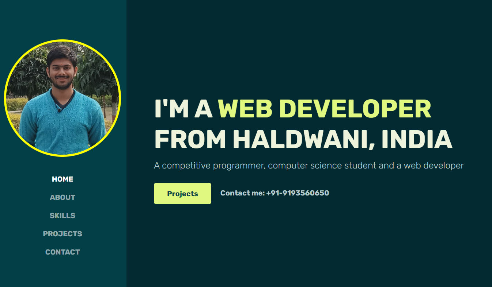
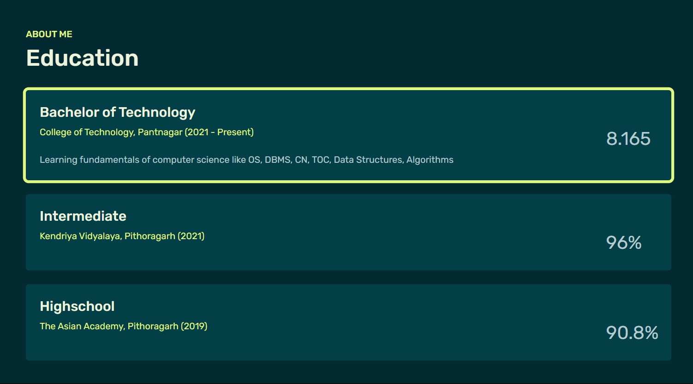
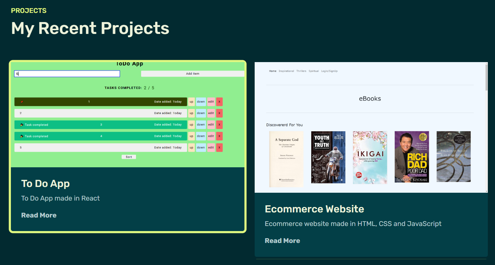

# My Portfolio Website

### Goals for next week

- Create own MVC architecture (forkify reference)
- Update text and photo
- Writing something in about section ✅
- Smooth Transition Everywhere
- Remove false trainings ✅
- Change "Read more" with '...', clicking on which, it opens rest of text
- Close nav toggler upon clicking anywhere (not only just on the toggler)
- Change copyright year dynamically from js
- Collect login data and footer form data in mongodb
- Create a `blogs` route and link it to your `blogging website`
- fetch college result from college website itself
- fetch copyright year in js

# Features

- Fully responsive website ✅
- Uses CSS animations ✅
- Multiple sections ✅
