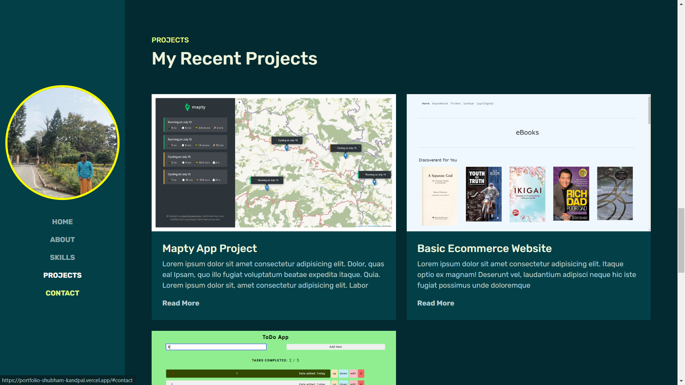

# My Portfolio Website

### Goals for next week

- Update text and photo
- Writing something in about section
- Smooth Transition Everywhere
- Remove false trainings
- Close nav toggler upon clicking anywhere (not only just on the toggler)
- Change copyright year dynamically from js
- Collect login data and footer form data in mongodb
- Create a `blogs` route and link it to your `blogging website`

# Features

- Fully responsive website
- Uses CSS animations
- Multiple sections
